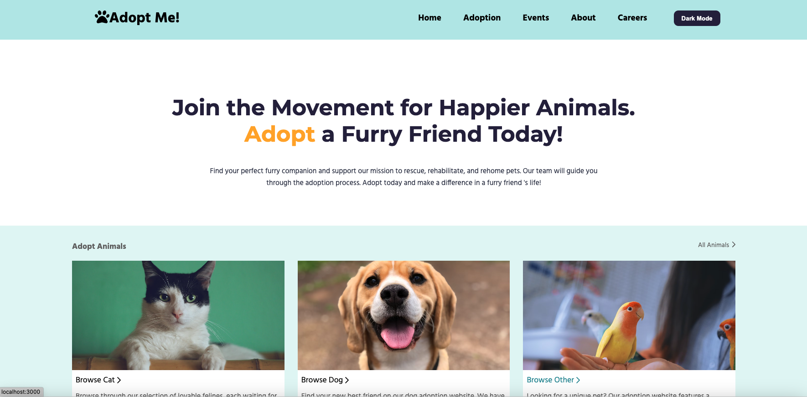

# Adopt Me

## Table of Contents

- [Adopt Me](#adopt-me)
  - [Table of Contents](#table-of-contents)
  - [Description](#description)
  - [Installation](#installation)
  - [Usage](#usage)
  - [Contributing](#contributing)
  - [License](#license)
  - [Contact](#contact)

## Description

**Adopt Me** is a Single Page Application (SPA) built with React, designed to help users find and adopt pets. This application provides a seamless and interactive experience for viewing and selecting pets available for adoption.



## Installation

To get a local copy up and running, follow these simple steps:

1. **Clone the repository**

   ```bash
   git clone git@github.com:LexieLiu19/AdoptMe-Info6150-FinalProject.git
   ```

2. **Navigate to the project directory**

   ```bash
   cd AdoptMe-Info6150-FinalProject
   ```

3. **Install dependencies**

   ```bash
   npm install
   ```

4. **Start the application**
   ```bash
   npm start
   ```

## Usage

Once the application is up and running, you can use it to browse available pets and get details on each one. Feel free to customize and extend the application to fit your needs.

## Contributing

Contributions are what make the open-source community such an amazing place to learn, inspire, and create. Any contributions you make are **greatly appreciated**.

1. **Fork the repository**
2. **Create a new branch** (`git checkout -b feature/YourFeature`)
3. **Commit your changes** (`git commit -m 'Add some feature'`)
4. **Push to the branch** (`git push origin feature/YourFeature`)
5. **Open a Pull Request**

## License

Distributed under the MIT License. See `LICENSE` for more information.

## Contact

Lexie Liu - [lexieliu0925@gmail.com](mailto:lexieliu0925@gmail.com)

Project Link: [https://github.com/LexieLiu19/AdoptMe-Info6150-FinalProject](https://github.com/LexieLiu19/AdoptMe-Info6150-FinalProject)
